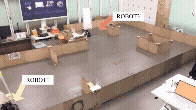
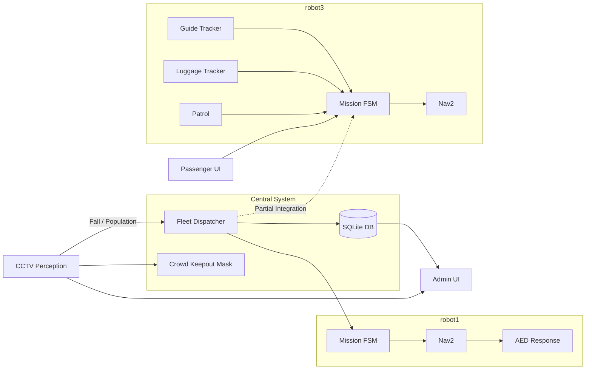

<div align="center">

# ✈️ AURA

### Airport Collaborative AMR Service Platform

**Multi-AMR · CCTV Perception · Fleet Management · Passenger Assistance**

공항 환경에서 두 대의 TurtleBot4가 협업하여  
**안내 · 러기지 어시스트 · 순찰 · 응급(AED) 대응**을 수행하는  
ROS2 기반 협동 AMR 서비스 시스템

<br>


<br>



### 🎬 [전체 시연 영상 보기](./assets/aura_demo.mp4)

</div>

---

## 📌 Project Overview

**AURA**는 공항과 같은 다중 이용 시설에서 여러 AMR이 역할을 분담하여  
승객 지원과 안전 관리 업무를 수행하도록 설계한 **ROS2 기반 협동 AMR 시스템**입니다.

고정형 CCTV가 주변 환경을 관찰하여 **쓰러짐 · 혼잡 · 인원수**를 감지하고,  
중앙 Fleet 시스템이 상황에 따라 로봇의 임무를 관리합니다.

| Robot | 주요 역할 | 제어 구조 |
|---|---|---|
| 🤖 **robot1** | 응급 상황 대응 · AED 전달 | 중앙 Dispatcher와 Action / Service 기반 연동 |
| 🤖 **robot3** | 승객 안내 · 러기지 어시스트 · 순찰 | Local Perception / Motion 기반 자율 동작 |

관리자는 **Admin Dashboard**를 통해 시스템 전체를 관제하고,  
승객은 각 AMR의 **Passenger UI**를 통해 서비스를 이용할 수 있습니다.

---

# ✨ Key Features

## 🚨 1. Emergency / AED Response

CCTV가 승객의 쓰러짐 상황을 감지하면 중앙 시스템으로 이벤트를 전달하고,  
**robot1**이 응급 대응 임무를 수행합니다.

```text
CCTV
  ↓
Fall Detection
  ↓
Fleet Dispatcher
  ↓
robot1 Mission FSM
  ↓
Nav2 Navigation
  ↓
AED Emergency Response
```

---

## 🧳 2. Luggage Assist

**robot3**는 전방 RGB-D 카메라를 이용하여 대상을 추적하고  
승객의 러기지 이동을 보조합니다.

```text
Passenger Request
       ↓
RGB-D Tracking
       ↓
Target Position
       ↓
Luggage Follower
       ↓
Robot3 Motion
```

---

## 🧭 3. Passenger Guide

후방 카메라를 이용하여 안내 대상과의 거리를 추정하고,  
승객이 로봇을 안정적으로 따라올 수 있도록 이동을 수행합니다.

```text
Rear Camera
     ↓
Guide Tracker
     ↓
Distance Estimation
     ↓
Guide Motion
     ↓
Robot3 Navigation
```

---

## 👥 4. Crowd-aware Navigation

CCTV에서 획득한 인원수 및 혼잡 정보를 이용하여  
혼잡 구역을 Nav2 Costmap의 **Keepout 영역**으로 반영합니다.

```text
CCTV Population Detection
          ↓
Crowd / Hot Place
          ↓
Keepout Mask Generator
          ↓
Nav2 Costmap
          ↓
Route Planning
```

이를 통해 로봇이 사람이 많이 몰린 구역을 피해 이동할 수 있도록 구성했습니다.

---

## 🖥️ 5. Dual UI System

사용 목적에 따라 관리자와 승객 UI를 분리했습니다.

| UI | 대상 | 주요 기능 |
|---|---|---|
| **Admin UI** | 관리자 | CCTV · AMR 상태 · 미션 · DB 모니터링 |
| **Passenger UI** | 승객 | AMR 서비스 선택 및 진행 상태 확인 |

---

# 🎬 Demo

최종 프로젝트 동작 영상입니다.

<p align="center">
  
</p>

<p align="center">
  <a href="./assets/aura_demo.mp4">▶️ 전체 시연 영상 보기</a>
</p>

---

# 🏗️ System Architecture



---

# 🤖 AMR Role

## robot1 — Emergency Robot

robot1은 **응급 대응 및 AED 전달**을 담당합니다.

### 주요 기능

- 중앙 Fleet Dispatcher와 통신
- Emergency Mission FSM
- Nav2 기반 목표 위치 이동
- AED 탑재 상태 관리
- 임무 결과 중앙 시스템 보고

```text
Fleet Dispatcher
      ↓
Mission Request
      ↓
Robot1 FSM
      ↓
Navigate To Pose
      ↓
Emergency Location
```

---

## robot3 — Passenger Assistance Robot

robot3는 승객 지원 서비스를 담당합니다.

### 주요 기능

- 🧭 Passenger Guide
- 🧳 Luggage Assist
- 🚶 Patrol
- 📍 Hot-place 이동
- 📷 Camera-based Tracking

Guide와 Luggage 기능은 각각  
**Perception Node + Motion Node** 구조로 구성했습니다.

---

# 👁️ Perception System

## CCTV Perception

고정 CCTV를 통해 공항 공간의 상황을 모니터링합니다.

### 주요 인지 정보

- 사람 검출
- 인원수 추정
- 혼잡 구역 판단
- 쓰러짐 감지
- Hot-place 생성

```text
CCTV Image
    ↓
YOLO11 Pose
    ↓
Human Keypoints
    ↓
Fall / Population Analysis
    ↓
ROS2 Topic
```

---

## Robot Camera Perception

robot3의 승객 안내 및 러기지 추적에는  
전방/후방 카메라를 활용합니다.

### Rear Camera
Guide 기능에서 승객과의 거리 및 위치 추적에 사용합니다.

### RGB-D Camera
Luggage Assist에서 목표 대상을 추적하는 데 사용합니다.

### UniDepthV2
단안 카메라 환경에서는 **UniDepthV2**를 활용하여  
깊이 정보를 추정할 수 있도록 구성했습니다.

---

# 🧠 Fleet Management

중앙 Fleet 계층은 여러 AMR의 상태와 임무를 관리합니다.

## `fleet_dispatcher_node`

- 응급 이벤트 수신
- 로봇 상태 확인
- 임무 배정
- 이벤트 및 우선순위 처리

## `db_manager_node`

SQLite를 기반으로 시스템 데이터를 기록합니다.

- AMR 상태
- 이벤트
- 임무 기록
- 시스템 로그

## `crowd_keepout_mask_node`

CCTV에서 획득한 혼잡 정보를  
Nav2 Costmap에서 사용할 수 있는 **Keepout Mask** 형태로 변환합니다.

---

# 🖥️ User Interface

## Admin Dashboard

관리자용 통합 관제 UI입니다.

```text
http://127.0.0.1:7000
```

### 주요 기능

- CCTV 영상 확인
- AMR 상태 모니터링
- 미션 상태 확인
- 이벤트 확인
- SQLite 데이터 확인

---

## Passenger UI

승객이 AMR 서비스를 사용할 수 있도록  
각 로봇별 Passenger UI를 제공합니다.

| AMR | Port |
|---|---:|
| **AMR1** | `5001` |
| **AMR3** | `5003` |

```text
AMR1 → http://127.0.0.1:5001
AMR3 → http://127.0.0.1:5003
```

---

# 🗂️ Repository Structure

```text
aura_ws/
│
├── src/
│   │
│   ├── fleet_interfaces/
│   │   └── ROS2 공용 msg / srv / action
│   │
│   ├── fleet_central/
│   │   ├── fleet_dispatcher
│   │   ├── db_manager
│   │   └── crowd_keepout
│   │
│   ├── robot1_control/
│   │   └── Emergency / AED Mission FSM
│   │
│   ├── robot3_control/
│   │   ├── guide tracker
│   │   ├── guide motion
│   │   ├── luggage tracker
│   │   ├── luggage follower
│   │   ├── patrol
│   │   └── mission FSM
│   │
│   └── cctv_perception/
│       └── YOLO 기반 CCTV Perception
│
├── ui/
│   ├── admin_ui/
│   └── passenger_ui/
│
├── third_party/
│   └── UniDepth/
│
├── maps/
│   └── new_map.yaml
│
├── docs/
│   ├── architecture.md
│   └── topics.md
│
├── assets/
│   ├── aura_demo.gif
│   └── aura_demo.mp4
│
├── requirements.txt
└── README.md
```

---

# 🛠️ Tech Stack

| Category | Technology |
|---|---|
| OS | Ubuntu 22.04 |
| Middleware | ROS2 Humble |
| Language | Python 3.10 |
| Mobile Robot | TurtleBot4 × 2 |
| Navigation | Nav2 |
| Vision | YOLO11 Pose |
| Depth Estimation | UniDepthV2 |
| Database | SQLite |
| UI | Flask |
| Camera | USB Camera / OAK-D / RGB-D |
| Communication | ROS2 Topic / Service / Action |
| Acceleration | NVIDIA CUDA *(optional)* |

---

# ⚙️ Installation

## 1. Clone Repository

```bash
cd ~

git clone --recurse-submodules <YOUR_REPO_URL> aura_ws

cd aura_ws
```

이미 Clone한 저장소라면:

```bash
git submodule update --init --recursive
```

---

## 2. Python Environment

ROS2 패키지와 함께 사용하기 위해  
`--system-site-packages` 옵션을 권장합니다.

```bash
python3 -m venv .venv --system-site-packages

source .venv/bin/activate

pip install -r requirements.txt
```

UniDepth 설치:

```bash
pip install -e third_party/UniDepth
```

---

## 3. ROS Dependencies

```bash
sudo apt update

rosdep install \
    --from-paths src \
    --ignore-src \
    -r -y
```

---

## 4. Build

공용 Interface 패키지를 먼저 빌드합니다.

```bash
cd ~/aura_ws

source /opt/ros/humble/setup.bash

colcon build --packages-select fleet_interfaces

source install/setup.bash
```

이후 전체 패키지를 빌드합니다.

```bash
colcon build --symlink-install

source install/setup.bash
```

새 터미널에서는:

```bash
source /opt/ros/humble/setup.bash
source ~/aura_ws/install/setup.bash
```

---

# ▶️ Run

각 구성 요소는 별도 터미널에서 실행합니다.

## 0. TurtleBot4 + Nav2

두 로봇의 Bringup과 Nav2를 먼저 실행합니다.

다음 Action이 활성화되어 있어야 합니다.

```text
/robot1/navigate_to_pose
/robot3/navigate_to_pose
```

---

## 1. CCTV Perception

```bash
ros2 run cctv_perception cctv_detector_node
```

---

## 2. Fleet Central

### Fleet Dispatcher

```bash
ros2 run fleet_central fleet_dispatcher_node
```

### Database

```bash
AURA_DB_PATH=$HOME/aura_data/amr_system.db \
ros2 run fleet_central db_manager_node
```

### Crowd Keepout

```bash
ros2 run fleet_central crowd_keepout_mask_node
```

---

## 3. robot1

```bash
ros2 run robot1_control robot1_mission_fsm_node
```

AED 탑재 여부를 설정하는 경우:

```bash
ros2 run robot1_control robot1_mission_fsm_node \
    --ros-args \
    -p aed_loaded:=true
```

---

## 4. robot3

### Guide

```bash
ros2 run robot3_control guide_rear_tracker_node
ros2 run robot3_control guide_motion_node
```

### Luggage Assist

```bash
ros2 run robot3_control luggage_rgbd_tracker_node
ros2 run robot3_control luggage_follower_node
```

### Patrol

```bash
ros2 run robot3_control robot3_patrol_node
```

### Mission FSM

```bash
ros2 run robot3_control robot3_mission_fsm_node \
    --ros-args \
    -p aed_loaded:=false
```

---

# 🖥️ Run UI

## Admin UI

```bash
cd ui/admin_ui

pip install -r requirements.txt

bash run.sh
```

접속:

```text
http://127.0.0.1:7000
```

---

## Passenger UI

```bash
cd ui/passenger_ui

pip install -r requirements.txt
```

AMR1:

```bash
python3 run_amr1.py
```

AMR3:

```bash
python3 run_amr3.py
```

둘을 동시에 실행:

```bash
python3 run_all_ui.py
```

---

# 🔧 Environment Variables

| Variable | Target | Default | Description |
|---|---|---|---|
| `AURA_DB_PATH` | DB / Admin UI | `~/Downloads/data/amr_system.db` | SQLite DB |
| `AURA_ADMIN_PORT` | Admin UI | `7000` | 관리자 UI Port |
| `AURA_ADMIN_CCTV_TOPIC` | Admin UI | `/cctv/image_raw/compressed` | CCTV Topic |
| `AURA_ROBOT_ID` | Passenger UI | `AMR1` | AMR 선택 |
| `AURA_PORT` | Passenger UI | `5001` | UI Port |
| `AURA_ALIGNMENT_INPUT_MODE` | Passenger UI | — | Alignment Mode |

---

# ✅ Startup Checklist

```text
[1] TurtleBot4 Bringup + Nav2
            ↓
[2] CCTV Perception
            ↓
[3] Fleet Dispatcher / DB / Keepout
            ↓
[4] robot1 Mission FSM
            ↓
[5] robot3 Perception / Motion / FSM
            ↓
[6] Admin UI
            ↓
[7] Passenger UI
```

주요 토픽이 정상적으로 보이면 시스템 연결을 확인할 수 있습니다.

```bash
ros2 topic list
```

확인 대상 예시:

```text
/fall_detection
/population
/robot1/status
/tracking_web
/tracking_rgbd
```

---

# 🧯 Troubleshooting

### `Package 'fleet_interfaces' not found`

```bash
colcon build --packages-select fleet_interfaces
source install/setup.bash
```

---

### `ModuleNotFoundError: unidepth`

```bash
git submodule update --init --recursive
pip install -e third_party/UniDepth
```

---

### YOLO Weight Load Error

`yolo11x-pose.pt` 파일과  
`cctv_detector_node`의 `MODEL_PATH` 설정을 확인합니다.

---

### Passenger UI가 print-only mode로 실행됨

ROS2 환경을 먼저 Source합니다.

```bash
source /opt/ros/humble/setup.bash
source ~/aura_ws/install/setup.bash
```

---

### Admin UI에서 CCTV가 보이지 않음

다음을 확인합니다.

```text
cctv_detector_node 실행 여부

AURA_ADMIN_CCTV_TOPIC
        ↕

실제 CCTV Topic
```

---

### NumPy Compatibility Error

프로젝트 환경에서는 다음 버전을 사용합니다.

```text
numpy < 2.0
```

---

# 📚 Documentation

세부 ROS2 구조와 인터페이스는 다음 문서를 참고하세요.

- [`docs/architecture.md`](docs/architecture.md)
- [`docs/topics.md`](docs/topics.md)

---

# 🔗 Credits

- UniDepth
- Ultralytics YOLO11
- ROS2 Humble
- TurtleBot4 / Nav2

---

<div align="center">

### ✈️ AURA

**Collaborative AMR Service for Smart Airport**

`Perception` · `Navigation` · `Fleet Management` · `Human-Robot Interaction`

</div>